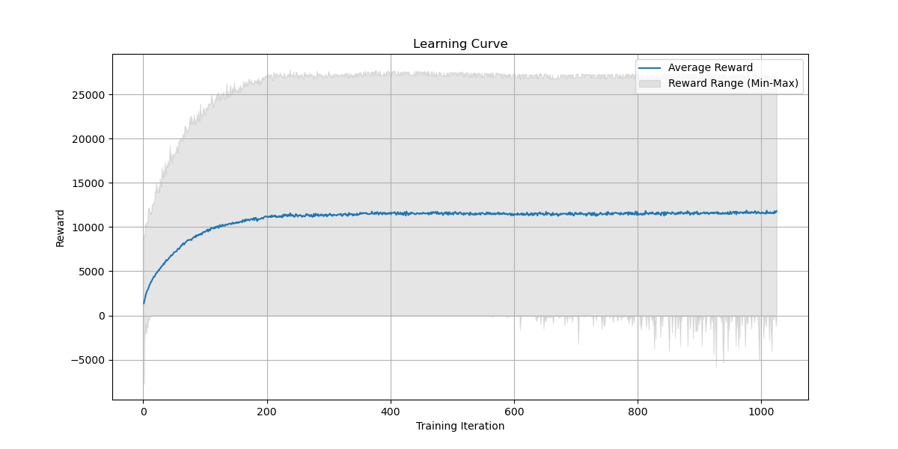

# Adaptive Stock Trading Agent

## Project Summary
This project develops a reinforcement learning (RL) agent that harnesses Proximal Policy Optimization (PPO) to optimize trading strategies in a simulated stock market. The agent analyzes historical stock data to execute buy, sell, or hold decisions aimed at maximizing portfolio value. It balances exploration of market behavior with the exploitation of known profitable trends, enhancing its net worth and managing risks and costs.

The RL agent's performance shows promise, evidenced by a general uptick in simulated portfolio value through training. Nonetheless, variability in its decision-making and periodic downturns in profitability highlight the complex nature of financial markets and the need for sophisticated, adaptive algorithms. These insights underscore the potential and challenges of applying RL to stock trading, with the goal of consistent strategy enhancement.

## State Space
The state space includes:

- Historical stock prices (Open, High, Low, Close) over the last five trading days.
- Trading volume for the same period.
- The trader's account balance and portfolio composition.
- Current stock holdings and the associated average cost basis.
- The total value of stocks sold and the accumulated sales revenue.

## Action Space
Actions within this environment are:

- **Trade Type**: Buy, sell, or hold.
- **Trade Quantity**: Percentage of the portfolio balance to invest or percentage of held shares to liquidate.

## Rewards
The agent is rewarded based on the increase or decrease in portfolio value after each action. This incentivizes maximization of returns and minimization of losses. Penalties for high transaction volumes can be included to discourage overtrading.

## RL Algorithm
Proximal Policy Optimization (PPO) is employed, a policy gradient algorithm suitable for the stochastic nature of stock markets.

## Starting State
Each training episode starts with:

- A set portfolio balance.
- No stock holdings.
- The initial segment of historical market data.

## Episode End
An episode ends if:

- The agent's net worth falls below a critical threshold.
- The end of the simulated trading period is reached.
- A pre-set number of time steps elapses.

## Results
The RL model has shown the ability to progressively increase the agent's net worth. However, high variance in rewards and a slight dip in performance towards the end of training suggest potential overfitting. Continuous adaptation is necessary for developing a robust and generalizable strategy.

In conclusion, the model shows learning and improvement in the task of stock trading but also exhibits a degree of inconsistency. The key takeaway is that while the average performance is good, there's room for improvement in terms of the stability and reliability of the trading strategy. Future work could involve refining the model to reduce variance, potentially by tuning hyperparameters, enhancing the state representation, or implementing a more sophisticated reward structure to guide the agent toward more consistent strategies.

